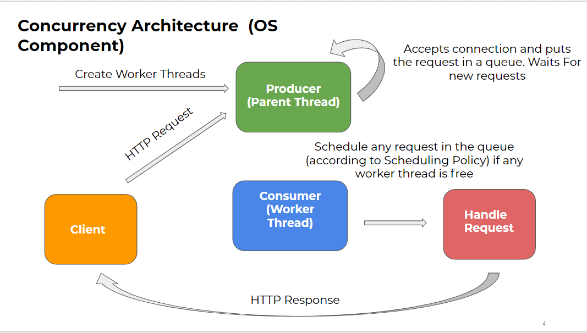
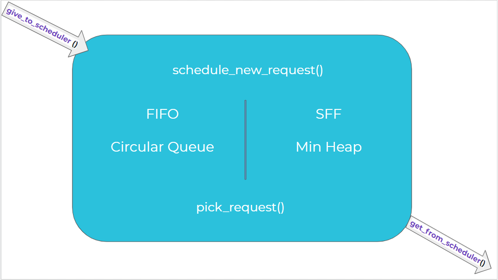
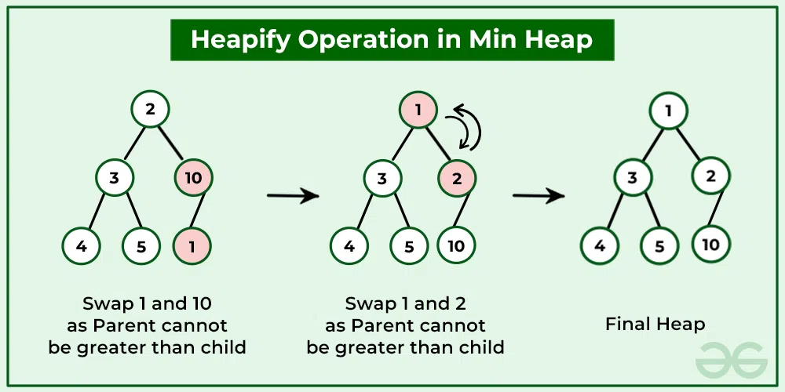

# Concurrent Webserver
Web server in two main aspects: making it multi-threaded and implementing different scheduling policies. Here's a summary:
### Part 1: Multi-threaded
The existing single-threaded web server has performance limitations where only one HTTP request can be serviced at a time.
The goal is to make the web server multi-threaded to handle multiple requests concurrently.
Two approaches are discussed: spawning a new thread for every request or creating a fixed-size pool of worker threads.
The preferred approach is to create a fixed-size pool of worker threads, managed by a master thread.
Worker threads handle both static and dynamic requests, waking up when there's an HTTP request in the queue.
Master and worker threads require synchronization, likely implemented using condition variables.

### Part 2: Scheduling Policies

Different scheduling policies are implemented for handling requests by worker threads.
Available policies include FIFO (First-in-First-out) and SFF (Smallest File First).
FIFO policy handles the oldest request in the buffer, while SFF prioritizes requests based on file size.
SFF policy requires initial processing of requests to determine file sizes, possibly done by the master thread.

Security

Security considerations are mentioned, including avoiding potential backdoors and constraining file requests to a sub-tree of the file system hierarchy.

### Server Scheduling  

#### for FIFO :
- I used queue to store the requests and pop the first request come each time to be handle 
- **Circular Queue** and its functionality created from **Scratch**

#### for SFF :
- I used heap to get the minimum size of each file associated with each request 
- **Heap** and its operations created from **scratch**

##### Min Heap example :

## How to Run

### Running the Server :
- **1)** :
Run the `make` command in the base directory to compile all the required files.

- **2)** :

Use the following command structure to run the server.

`prompt> ./wserver [-d basedir] [-p port] [-t threads] [-s SFF or FIFO]`

The command line arguments to your web server are to be interpreted as follows.

- basedir: This is the root directory from which the web server should operate. Default: current working directory (e.g., .).

- port: The port number that the web server should listen on. Default: 10000.

- threads: The number of worker threads that should be created within the webserver. Must be a positive integer.

- Scheduling Algo: The scheduling algorithm to be performed. Must be one of FIFO or SFF . Default: FIFO.

For example, you could run your program as:

`prompt> ./wserver -d . -p 8003 -t 8 -s SFF`

In this case, your web server will listen to port 8003, create 8 worker threads for handling HTTP requests, allocate 16 buffers for connections that are currently in progress (or waiting), and use SFF scheduling for arriving requests.

### Running the Client :

Use the following command to run the client:

`prompt> ./wclient <host> <port> <filename(s)>`

The command line arguments to your client are to be interpreted as follows.

- **host**: IP of the server. By default localhost/127.0.0.1
- **port**: The port on which the server is listening. Default: 10000
- **filenames(s)**: Can provide paths to multiple files seperated by spaces.

For example, you could run your program as:

`prompt> ./wclient localhost 8003 ./cc.html `

##### The source code contains the following files:

- wserver.c: Contains main() for the web server and the basic serving loop.

- request.c:Performs most of the work for handling requests in the web server. All the requests sent to the server are handled in separate threads using request_handle() function present in this file.

- io_helper.h and io_helper.c: Contains wrapper functions for the system calls invoked by the basic web server and client. The convention is to add _or_die to an existing call to provide a version that either succeeds or exits. For example, the open() system call is used to open a file, but can fail for a number of reasons. The wrapper, open_or_die(), either successfully opens a file or exists upon failure.

- **wclient.c**: Contains main() and the support routines for the very simple web client. It is a multi-request client.

- **thread_pool.c**: Contains all the scheduler level APIs to create threads, start threads, schedule a new request, pick a request, give to scheduler and get from scheduler.

- **heap.c**: Contains core heap implementation and all methods required for the data structure.

- **queue.c**: Contains core circular queue implementation and all methods required for the data structure.

- **definitions.h**: Contains function definitions and struct details for server

- **helpers.c**: Contains the helper function to provide the size of a file or size of the name of the file requested by the client, before scheduling the request. These parameters help in implementing SFF  scheduling policies.

- **spin.c**: A simple CGI program. Basically, it spins for a fixed amount of time as given in the request.

- **Makefile**: It compiles the wserver, wclient, and spin.cgi programs. It also has predefined rules for running SFF, FIFO and SFNF scheduling policies for the server.

#### Testing :

to Send Multiple Requests to running server to test the scheduling  use this command :

`./wclient_req_test.sh` 

It sends 100 request to the Server and we are logging the number of Requests in the Buffer so you will be able to see the scheduling running in your terminal 

**Note**: don't forget to run `chmod x wclient_req_test.sh ` so you will be able to run this script file 